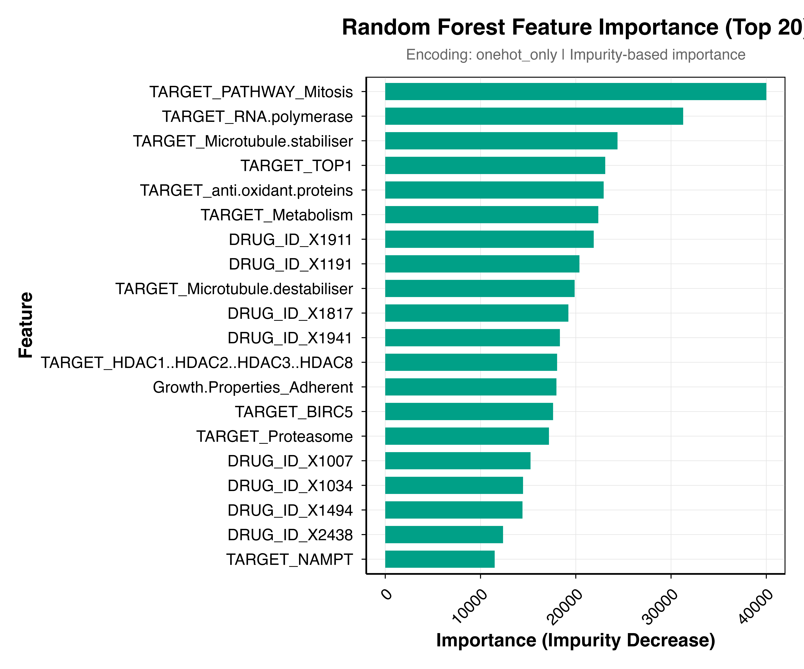

# Drug Sensitivity Prediction Pipeline

A reproducible R pipeline for predicting cancer drug sensitivity using machine learning.

[](https://bio215.shinyapps.io/gdsc_database_and_predictor_215/)
[](https://github.com/XinmiaoWu-xjtlu/GDSCpredictor)

## 🌐 Live Demo & R Package

| Resource | Description | Link |
|----------|-------------|------|
| **Shiny App** | Online database explorer + drug sensitivity predictor | [🔗 Launch App](https://bio215.shinyapps.io/gdsc_database_and_predictor_215/) |
| **R Package** | Install predictor locally via GitHub | [📦 GDSCpredictor](https://github.com/XinmiaoWu-xjtlu/GDSCpredictor) |

```r
# Install R package from GitHub
devtools::install_github("XinmiaoWu-xjtlu/GDSCpredictor")
```

---

## Key Results

### Model Performance Comparison

*Test RMSE across 10 models and 4 encoding strategies. Random Forest + target encoding achieves best performance (RMSE = 1.10).*

### Prediction Quality

*Predicted vs Actual LN_IC50 for Random Forest. Strong correlation (r = 0.92) with tight clustering around diagonal.*

### Generalization Under Different Splits

*Performance degrades substantially for out-of-distribution scenarios (LODO, LOCO), revealing memorization patterns.*

### Model Interpretability

*Random Forest feature importance with one-hot encoding reveals biologically meaningful patterns.*

---

## Quick Start

```bash
# Navigate to scripts folder
cd scripts_organized

# Run pipeline in order
Rscript 01_data_preprocessing.r
Rscript 02_train_test_split.r
Rscript 03_feature_encoding.r
Rscript 04_model_training.r
Rscript 05_performance_analysis.r
```

## Folder Structure

```
scripts_organized/
├── config.r                     # ⚙️ Configuration (EDIT PATHS HERE)
├── 01_data_preprocessing.r      # Step 1: Clean data, handle missing values
├── 02_train_test_split.r        # Step 2: 80/20 split (before encoding!)
├── 03_feature_encoding.r        # Step 3: Apply 4 encoding strategies
├── 04_model_training.r          # Step 4: Train 5+ models
├── 05_performance_analysis.r    # Step 5: Visualize results
├── utils/
│   ├── metrics.r                # Evaluation metrics (RMSE, MAE, R², r)
│   ├── encoding_functions.r     # One-Hot, Frequency, Target encoding
│   └── publication_theme.r      # ggplot2 theme and colors
├── hpc/                         # (Optional) HPC submission scripts
├── assets/                      # Example output figures
├── data/                        # Processed data files
└── output/
    ├── figures/                 # Generated plots
    ├── tables/                  # Result CSVs
    └── models/                  # Saved model files
```

## Before Running

1. **Edit `config.r`**: Update `BASE_DIR` to your project path:
   ```r
   BASE_DIR <- "/your/path/to/Casptone_Project"
   ```

2. **Ensure input data exists**:
   - Raw data: `data/cleaned/GDSC_selected_columns.csv`

3. **Install required packages**:
   ```r
   install.packages(c("dplyr", "tidyr", "ggplot2", "glmnet", "ranger", "xgboost", "rpart"))
   ```

## Pipeline Overview

| Step | Script | Description | Output |
|------|--------|-------------|--------|
| 1 | `01_data_preprocessing.r` | Clean data, fill missing with "Unknown" | `GDSC_cleaned.csv` |
| 2 | `02_train_test_split.r` | 80/20 split BEFORE encoding | `train_raw.csv`, `test_raw.csv` |
| 3 | `03_feature_encoding.r` | Apply 4 encoding strategies | `train_*.csv`, `test_*.csv` |
| 4 | `04_model_training.r` | Train models | `models/*.rds` |
| 5 | `05_performance_analysis.r` | Generate figures | `figures/*.png` |

## Encoding Strategies

| Strategy | Low Cardinality | Medium | High | Features |
|----------|-----------------|--------|------|----------|
| `onehot_only` | One-Hot | One-Hot | One-Hot | ~1535 |
| `onehot_freq` | One-Hot | Frequency | Frequency | ~15 |
| `onehot_target` | One-Hot | Target | Target | ~15 |
| `onehot_freq_target` | One-Hot | Frequency | Target | ~15 |

## Key Findings

1. **Best Model**: Random Forest + target encoding (RMSE = 1.10, R² = 0.84)
2. **Best Trade-off**: XGBoost (similar accuracy, 750x faster training)
3. **Generalization Gap**: LODO evaluation shows large performance drop
4. **Interpretability**: One-hot encoding reveals meaningful biological patterns

## Reproducibility

- All scripts use `set.seed(42)`
- Split indices saved in `data/split_indices.rds`
- Encoding mappings saved for consistent test set encoding

## Requirements

- R >= 4.3
- Packages: dplyr, tidyr, ggplot2, glmnet, randomForest, ranger, xgboost, rpart

## Authors

*   **Xinmiao Wu** (Package Maintainer & R Development)
*   **Yihan Zhou** (Machine Learning Model)
*   **Chonghui Ni** (Web Application Integration)

---

*Last updated: 2025-12-23*
